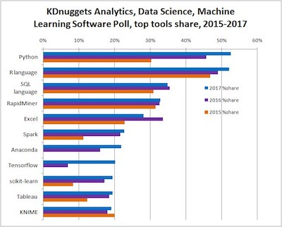
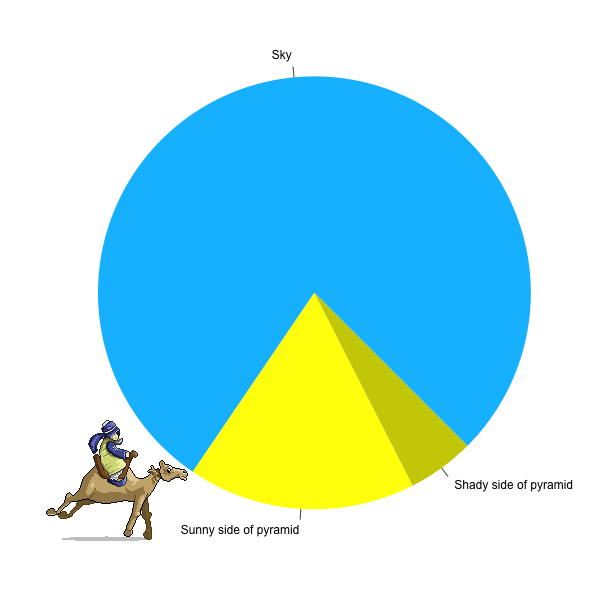

```{r setup, include=FALSE}
knitr::opts_chunk$set(echo = FALSE)
options(scipen=999)
```

## Hello R!

This presentation can be found online:
<br>

<div class="red2">
witusj.github.io/hellor/hellor.html
</div>

<em>press **F** for fullscreen</em>

<br><hr>
For the workshop R (Dutch) go to:
<br>

[witusj.github.io/WorkshopSI/](https://witusj.github.io/WorkshopSI/)


<br><hr>
Workshop documents can be found here (*docs* folder):
<br>

[https://github.com/witusj/hellor](https://github.com/witusj/hellor)


## Who R we?

[Eghe Osagie](https://www.linkedin.com/in/erosagie/)

- Assistant Professor at [HAN University of AS](https://www.han.nl/)
- Lecturer Bachelor & Master HRM
- Interests:  Employability, Sustainability, HRA, Research methodology
<br>
<br>

[Witek ten Hove](https://www.linkedin.com/in/witektenhove/)

- Instructor at [HAN University of AS](https://www.han.nl/)
- Coördinator of [MSI](https://minorsmart.github.io/portfolio/)
- Interests: Business Economics, Data Engineering, Data Mining, AI, Web Dev.
  

## R in the Data Science UniveRse

<div class="columns-2">

```{r echo=FALSE, message=FALSE, warning=FALSE, paged.print=FALSE, fig1, fig.height = 2, fig.width = 4}
library(leaflet)

m <- leaflet() %>%
  addTiles() %>%  # Add default OpenStreetMap map tiles
  addMarkers(lng=174.768, lat=-36.852, label= "The birthplace of R", labelOptions = labelOptions(noHide = T))
m  # Print the map
```



- Origin: S-language (1975)
- Created in 1995 by Ross Ihaka & Robert Gentleman at the University of Auckland
- Ranking second as tool for data science (after Python)

</div>

## Advantages of R

<div class="row">
  <div class="column">
  
```{r message=FALSE, warning=FALSE, paged.print=FALSE, fig2, fig.height = 3.5, fig.width = 3.8}
packages <- read.csv("pkgs.csv")
library(ggplot2)
library(plotly)
p <- ggplot(packages, aes(as.Date(first_release), index)) +
      geom_line(size = 2, color = "Red") +
      scale_x_date(date_breaks = '2 year', date_labels = '%Y') +
      scale_y_continuous(breaks = seq(0, 15000, 1000)) +
      xlab('') + ylab('') + theme_bw() +
      ggtitle('Number of R packages published on CRAN')

p <- ggplotly(p)
p
```
  </div>
  
  <div class="column">
   - [Open Source](https://www.r-project.org/)
   - `r round(dim(packages)[1], digits = -3)`+ [packages](https://cran.r-project.org/web/packages/available_packages_by_name.html)
   - <a href="https://www.rstudio.com/" target="_blank">User-friendly IDE</a>
   - <a href="https://www.r-bloggers.com/" target="_blank">Well documented</a>
   - Many input connectors
   - Many output formats
  </div>
</div>

## Some examples - Simple Chart

```{r echo=TRUE, message=FALSE, warning=FALSE, paged.print=FALSE}
pie(c(a=78, b=17, c=5),
    init.angle = 315,
    col = c("deepskyblue", "yellow", "yellow3"),
    border = FALSE,
    radius = 1.0)
```

## Some examples - Animations



## Some examples - JavaScript
```{r echo=TRUE, message=FALSE, warning=FALSE, paged.print=FALSE, fig3, fig.height = 3.8, fig.width = 8}
library(threejs)
 data(ego)
 graphjs(ego, bg="black")
```

## Some examples - Shiny App
<iframe src="https://tenhove.shinyapps.io/renkum/"></iframe>
